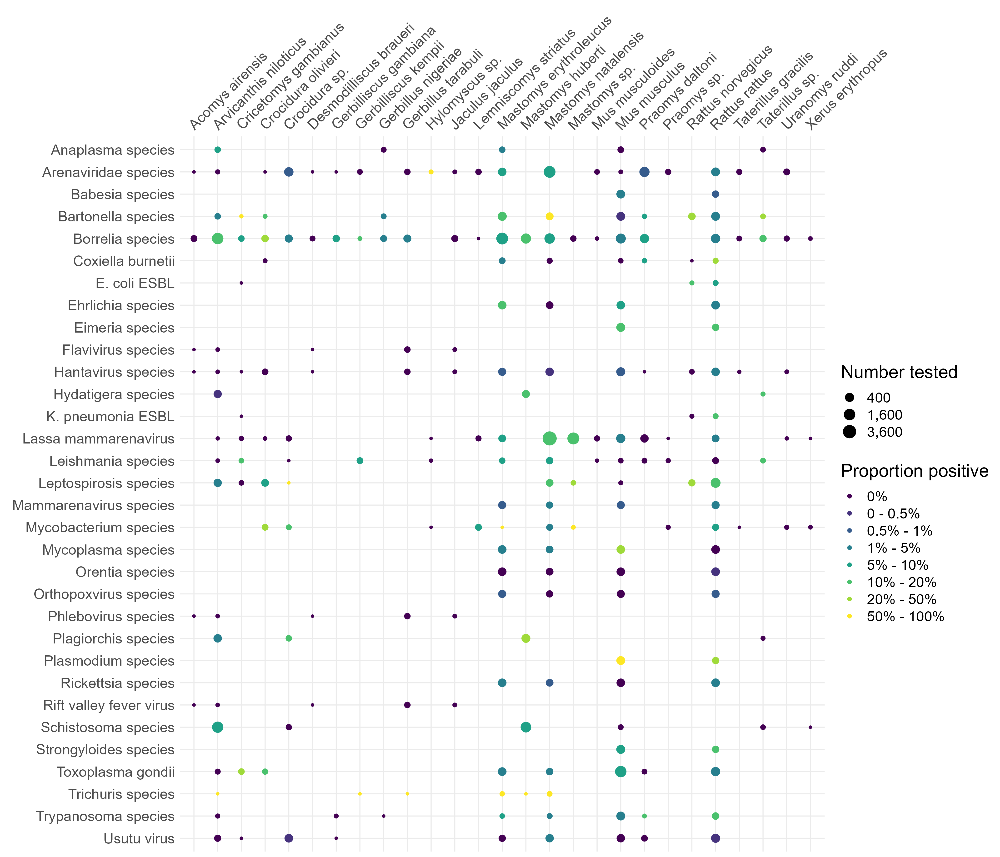

```{r, echo=FALSE, include=FALSE}
source(here::here("scripts", "manuscript_library.R"))
```

# Abstract

Rodents are important reservoirs of zoonotic infectious diseases; 255 species are known hosts of 85 zoonotic pathogens. These reservoir species are globally distributed with West Africa containing multiple known and several further predicted reservoir species. Typically International Union for Conservation of Nature (IUCN) species distribution maps and Global Biodiversity Information Facility (GBIF) presence maps are used to determine regions at risk for zoonotic spillover events, however, these datasets are biased by incomplete sampling. To investigate the impact of rodent species sampling heterogeneity on zoonotic spillover risk we have systematically reviewed rodent trapping studies to produce a contextually rich dataset that can be used to explore this risk at finer spatial resolution. Here we show that sampling of rodents and their pathogens in the West African region are spatially biased by country and trapping habitat. We found that rodent trapping effort was associated with regional population density and was increased in habitats modified by human activity. We produce updated rodent species ranges compared to available IUCN maps and enrich GBIF data by including locations of rodent species absence and trapping effort. Furthermore, we report the spatial bias in the investigation of four important rodent zoonoses, Arenaviridae, *Borellia sp.*, *Bartonella sp.* and *Toxoplasma sp.*. Our results highlight that incorporating sampling bias is important when assessing the risk for zoonotic spillover events from rodents. The synthesis of contextually rich rodent trapping data contributes important information that is lacking in IUCN distribution maps and GBIF species presence data. We anticipate this dataset can support the production of more complete spatial risk assessments of zoonotic spillover events. For example, the inclusion of absence data and trapping effort can help identify regions where data sparsity may produce inappropriately predicted risk. Furthermore, these data identify regions in need of comprehensive study for our four targeted rodent zoonoses, Arenaviridae, *Borellia sp.*, *Bartonella sp.* and *Toxoplasma sp.*.

# Introduction

The potential effect of zoonotic infectious diseases outbreaks on human health and societies has been dramatically highlighted through the ongoing SARS-CoV-2 pandemic and recent Ebola virus outbreaks. The number of zoonotic spillover events are projected to increase under intensifying anthropogenic pressure such as, increased human populations [@allen_global_2017], increasing urbanisation [@hassell_urbanization_2017], and global climate change [@morse_prediction_2012]. In addition, two taxa - rodents (Rodentia) and bats (Chiroptera) - are proposed to contribute to the greatest number of zoonotic pathogens and the greatest risk of novel pathogen emergence [@han_rodent_2015]. Of 2,220 extant rodent species, 244 (10.7%) are described as being reservoirs of 85 zoonoses [@han_global_2016]. Specifically, West Africa has previously been identified as region at increased hazard for rodent-borne zoonotic spillover events under different projected scenarios [@garcia-pena_land-use_2021]. Rodents are implicated in the transmission pathways of several human diseases in this region, including, Lassa fever, Schistosomiasis and Leptospirosis [@meerburg_rodent-borne_2009].

Rodent species form diverse assemblages, which provide important and beneficial ecosystem services including pest regulation and seed dispersal [@fischer_ecosystem_2018]. The role of rodent species' in zoonotic infectious disease spillover or novel pathogen emergence can be viewed as an ecosystem disservice. Rodents typically demonstrate “fast” life histories [@dobson_fast_2007], these traits are also associated with a species being a reservoir of zoonotic pathogens [@han_rodent_2015; @albery_fast-lived_2021]. Further, these traits are prevalent in species that thrive in human dominated landscapes where they displace species that are less likely to be reservoirs of zoonotic pathogen [@gibb_zoonotic_2020]. The widespread occurrence of reservoir species and their proximity to human activity make the description of rodent species assemblages and host-pathogen interactions vitally important to understanding the risk of zoonotic spillover and novel pathogen emergence [@han_global_2016]. 

Rodent trapping studies provide a useful method to describe rodent population structures and survey for potential zoonoses. Studies have been conducted in West Africa to both identify novel potential zoonotic pathogens within rodents [@usaid_one_2021] and to investigate the prevalence and burden of known pathogens within known rodent hosts (e.g. for Lassa fever [@fichet-calvet_diversity_2009] and Schistosomiasis [@catalano_multihost_2020]). These studies provide contextually rich information on when, where and under what conditions rodents were trapped that are typically missing from the global datasets [@bovendorp_optimising_2017]. Despite this, these global datasets (e.g. IUCN, GBIF and GIDEON) are typically used to inform species distribution maps and zoonotic disease spillover predictions [@han_global_2016; @smith_global_2014; @pigott_mapping_2014].

These studies have been used to identify potential geographic hotspots where virus and host species diversity may be expected to be at its greatest to predict regional zoonotic disease spillover risks. However, there remains the potential for important confounding in these spatial distributions through bias generated by study design and selection of sampling sites [@plowright_sampling_2019]. For example, systematically increased sampling (e.g. more intensive studies over longer time periods) or over-representation of certain habitats (e.g. peri-urban landscapes) could lead to an apparent association between locations and risk that is driven by these factors rather than an underlying host and virus association [@wille_how_2021; @gibb_mammal_2021]. Conversely some regions may not be sampled adequately and therefore under-represented in these datasets due to sparse human populations or inaccessible habitats this may result in these regions being reported inappropriately as at low risk of novel pathogen emergence or zoonotic disease spillover events.

Here, we identify rodent trapping studies performed across West Africa and identify the location and habitat types in which they have been conducted, the pathogens assessed and the host-pathogen associations that have been reported in order to quantify the potential bias and to identify regions requiring further focussed investigation.

# Methods

## Literature search

We conducted a search in Ovid MEDLINE, Web of Science (Core collection and Zoological Record), JSTOR, BioOne, African Journals Online, Global Health and the pre-print servers, BioRxiv and EcoEvoRxiv for the following terms as keywords, no date limits were set: 
  
  1. Rodent OR Rodent trap*
  2. West Africa (or the individual countries)
  3. 1. AND 2.

We searched other resources including the UN Official Documents System, Open Grey, AGRIS FAO and Google Scholar using combinations of the above terms. Searches were run on 2021-03-01.

We included studies if they met all of the following inclusion criteria; i) reported findings from trapping studies where the target was a small mammal, ii) described the type of trap used or the length of trapping activity or the location of the trapping activity, iii) included trapping activity from at least one West African country, iv) recorded the genus or species of trapped individuals, v) were published in a peer-reviewed journal or as a pre-print on a digital platform or as a report by a credible organisation. We excluded studies if they met any of the following exclusion criteria: i) reported data that were duplicated from a previously included study, ii) no full text available, iii) not available in English. One reviewer screened titles, abstracts and full texts against the inclusion and exclusion criteria. At each stage, a random subset (10%) was reviewed by a second reviewer.    
  
## Data extraction

We extracted data from eligible studies into a Google sheets document. Extracted variables included i) study identifiers; ii) study aims; iii) trapping methodology; iv) geolocation data; v) method of speciation; vi) trapping locations and dates; vii) trapped species; viii) number of trap-nights and ix) microorganisms/pathogens of interest. The data extraction tool is archived and available in Supplementary 1 or at this [link](https://docs.google.com/spreadsheets/d/1rQYjHhk6uk1PoKZZVsgFlmuqWGicU2tTisk9ddfAwTM/edit?usp=sharing). 

### Location of rodent trapping studies and habitats studied

We extracted GPS locations for the most precise location presented (i.e. trap, trap-line, study site or study region). We extracted coordinates in the format reported and converted them to decimal degrees. We recorded the habitat classification scheme used by a study (e.g. IUCN Habitat Classification Scheme (Version 3.1)). For studies not using standardised habitat recording, the explicit description of the habitat in which the trap was placed were extracted. For studies reporting multiple habitat types (e.g. rice field, corn field and vegetable garden) for a single trap, trap-line or trapping grid, a higher order classification of habitat type was recorded (e.g. agricultural land).

### Rodent presence, absence, abundance

We mapped genus and species names to the species names used in the Global Biodiversity Information Facility (GBIF) taxonomy  [@gbif_the_global_biodiversity_information_facility_global_2021]. We extracted information on the presence, absence and number of trapped individuals. For studies reporting on all trapped individuals (i.e. not those only reporting on the presence of a specific species of interest), the pseudo-absence of a species reported as present elsewhere in the study was explicitly recorded as an absence at that trap location.

### Pathogen presence and absence

We extracted data on all pathogens assayed in studies investigating rodents for potential zoonoses. The number of rodents tested and the number of positive or negative samples were recorded alongside the type of assay used (e.g. Polymerase Chain Reaction (PCR), Enzyme Linked ImmunoSorbent Assay (ELISA) or viral culture). If studies reported indeterminate results this was noted. Where possible, pathogens were identified to species level. However, where an assay only allowed for attribution to a family of viruses or bacteria, the higher order grouping was used (e.g. Arenaviridae for a PCR using a non-specific arenavirus primer).

## Analysis

### Location and habitats of rodent trapping to investigate potential biases

We summarised the number of studies, the year in which trapping occurred and the country in which they were conducted. We used the GPS coordinates of single trap, trapping grid/line or study site and the number of trap nights to calculate trapping effort (trap night density) within level 2 administrative areas in West Africa. The median trap success rate for all rodents at a defined trap site was calculated separately for trap sites which included built environments and non-built environments due to important differences in trap success between these different environments. The number of rodents trapped at a trap site was then used in combination with these values of trap success to impute the number of trap nights for trap sites where there was no record of the number of trap nights. We summarised the habitat types of trap sites based on information reported in the study, the dictionary used to match habitat types is available in Supplementary 2.

For studies investigating rodent zoonoses we compared the location of trapping sites with SEDAC Global Population Density estimates for 2005 - the median year studies were started [@socioeconomic_data_and_applications_center_gridded_2021]. We used a Generalised Additive Model (GAM) incorporating a spatial interaction term to investigate the association of number of trap nights and human population density [@pedersen_hierarchical_2019]. The model structure was specified as:

$$
\text{Trap night density} \sim Tweedie(log(Population density_{2005}) + (Longitude * Latitude))   
$$

We obtained land cover classifications from the European Space Agency Copernicus dataset at 300m^2^ spatial resolution generated using Copernicus Climate Change Service information (2005) we extracted the proportion of land cover classes within all regions of West Africa and all regions in which rodent trapping occurred for investigation of zoonotic diseases. We compared the proportion of possible land cover classes with those of regions where trapping occurred.

Finally, we mapped the presence and absence of rodent species and compared this to the presence and absence produced from GBIF [@gbif_the_global_biodiversity_information_facility_occurrence_2021] and IUCN [@iucn_iucn_2021] datasets to give a measure of the extent of each species range in which they have been sampled. 

### Rodent pathogen associations

We summarised the presence and absence of microorganisms, the assays used, their host species and the locations from where the samples were obtained. We investigated the association between rodent species and the detection of potential pathogens and report the proportion of positive and negative tests for each species and pathogen pair.

# Results

## Included studies

We identified 4,282 relevant citations, with 126 rodent trapping studies included. The list of included studies in available in Supplementary 3 or through the interactive web based application produced to explore this dataset, available [here](https://diddrog11.shinyapps.io/scoping_review_app/). The earliest included studies were published in 1974 with increasing numbers of studies being performed annually since 2005. The median length of rodent trapping activity was one year (IQR 0-2 years). The median time from completion of rodent trapping to publication is 3 years (IQR 2-5 years) (Figure 1.).


## Location and habitats of rodent trapping studies to investigate potential biases

Rodent trapping took place at 1,331 trap sites with at least one trap site recorded from 14 West African countries. No rodent trapping studies were identified from Gambia or Togo. The most frequently studied countries were Senegal, Ghana, Guinea and Nigeria (more than 10 studies each). Fewer than 5 studies were conducted in Liberia, Burkina Faso and Guinea-Bissau. Thirty-one (25%) studies reported trapping at a single study site, 46 (37%) studies trapped at between two and five study sites, the remaining 49 studies trapped at between six and 93 study sites. Trap sites were situated in 273 (19.3%) of 1414 level 2 administrative regions in the 14 West African nations. The areas with highest trap night density included the capital cities of Niger (Niamey), Sierra Leone (Freetown), Senegal (Dakar), Mali (Bamako) and Ghana (Accra) and the largest cities of Côte d'Ivoire (Abidjan) and Benin (Cotonou). Outside of these cities, Northern Senegal (Fatique, Thies, Saint-Louis and Kedougou), Southern Guinea (Kindia and Nzerejore), Edo and Osun States in Nigeria and Eastern Sierra Leone had the highest density of trap nights (Figure 2. A).

Greater numbers of trap nights were conducted in areas with higher population densities (*R~2~* = 0.18) adjusting for spatial autocorrelation. In particular Mauritania, Northern Senegal, Eastern Sierra Leone, Eastern Guinea and South West Nigeria were trapped at higher rates than would be expected based on their population densities. South West Nigeria, Northern Nigeria, Liberia, Côte d'Ivoire, Ghana, Niger and Burkina Faso were trapped at lower rates than would be expected.

![**A:** Map of West Africa, countries where rodent trapping has occurred are mapped to level 2 administrative areas. The colour of the region corresponds to the trap night density per 1000 km^2. Colourless regions reported no trapping. **B:** This shows the linear predictor from obtained from the GAM. Predictions are limited to coordinates are trap sites (coloured areas), uncertainty in the linear predictor is represented by th transparency of the colour. Yellow regions represent areas with higher than expected trapping effort for the regional population and purple regions represent areas trapped at lower than expected rates based on their populations](../figures/Figure_2.png)

No studies reported trap habitats with reference to a standardised habitat classification scheme. Extracted habitat types were grouped into 30 categories (see Supplementary Material 2 for the habitat dictionary). At least one habitat was recorded for 17,122 trap sites (95%), with two or more habitats for a single trap site recorded for 4,403 (24%) sites. Single trap sites could span multiple habitat types resulting in 22,202 distinct habitat and trap sites. The most commonly trapped sites were in or around buildings (29%), in areas described as the rodents “natural habitat” (24%), in agricultural areas (13%) (e.g. rice fields, palm plantations), forests (8%) and in the area surrounding buildings (4%).


## Rodent presence, absence, abundance

73,164 small mammals were trapped (592 were trapped outside of West African countries), 2,830 (4%) trapped individuals were identified to order level (Rodentia), 7,760 (11%) were identified to genus level, the remaining 62,574 (85%) were identified to species level. In studies reporting the number of trap nights the median trap success rate of traps placed in or around buildings was 13% (IQR 6-24%), this compares to a median trap success rate of 3% (IQR 1-9%) in other habitats. The majority of the 147 species trapped were Rodentia (112) (Supplementary Material 3), of these Muridae (82) were the largest family of rodents, followed by, Sciuridae (10), Gliridae and Nesomyidae (both 6), Ctenodactylidae, Anomaluridae, Dipodidae, Hystricidae and Thryonomidae (2 or fewer). The remaining 34 species were from the orders of Soricomorpha (30), Erinaceomorpha (2) and Afrosoricida (1).

*Mastomys sp.* were the most commonly trapped genus (27,079, 37.7%), followed by, *Rattus sp.* (11,472, 16.1%), *Mus sp.* (8,624, 12.0%), *Arvicanthis sp.* (5,821, 8.1%) and *Praomys sp.* (5,409, 7.5%). *Mastomys natalensis* were the most commonly trapped species (11,116, 17.4%), followed by, *Rattus rattus* (9,959, 15.6%), *Mastomys erythroleucus* (7,386, 11.6%), *Mus musculus* (6,245, 9.8%), *Arvicanthis niloticus* (5,497, 8.6%), *Mastomys huberti* (4,699, 7.4%) and *Praomys daltoni* (1,854, 2.9%). 

Locations of points for the presence or absence of the seven most commonly trapped species are shown in Figure 3 (left column). Absence include true absences and pseudo-absences dependent on the trapping effort at the site. This are shown compared to species presence obtained from GBIF (centre column) and IUCN species range data (left column) (Figure 3). 

![Each row corresponds to a single rodent species. The column on the left shows the presence and absence of a rodent species from the individual studies included in this review. The centre column shows the presence of a rodent species obtained from GBIF (September 2021) for records where longitude and latitude have been provided. The right column shows the range of rodent species as proposed by the IUCN (2021) (red shaded area), overlaid are the presence points from both this review and GBIF records.](../figures/Figure_4.png)

## Pathogen presence and absence

Sixty-two studies presented data on microorganisms that infect or are carried by small mammal species in West Africa. Seven studies solely investigated pathogens of rodents, including Hydatigera species (previously Taenia species) and Trichuris species. Zoonotic pathogens and potentially zoonotic micro-organisms were investigated in 55 studies. Thirty-two microorganisms were tested for, 8 of these were specified to species level, the remaining 24 were specified at higher taxonomic classifications.

Polymerase Chain Reaction (PCR) was used in 32 studies to detect the presence of 22 different species or families of microorganisms from 21,953 rodent samples. The most common microorganisms assayed for using PCR were *Lassa mammarenavirus* or other Arenaviridae (31%) the bacteria *Borrelia sp.* (11.3%) and *Bartonella sp.* (6.5%), followed by Usutu virus (6.4%) and Hantaviridae (5.6%). Molecular tests (antibody or antigen based) were used in 11 studies to detect the presence of 9 different species or families of microorganisms from 11,430 rodent samples. The most common pathogens assessed for with serology were *Lassa mammarenavirus* or other Arenaviridae (78%), *Toxoplasma gondii* (10.6%), *Borrelia sp.* (6.3%) and *Leptospirosis sp.* (2.2%). Histological or direct visualisation assays were used in 8 studies investigating 11 parasitic or bacterial species from 11,229 rodent samples. The most common pathogens assessed for with histology or direct visualisation were *Borrelia sp.* (48.7%), *Schistosoma sp*. (20.4%) and other parasites. Direct culture of *Lassa mammarenavirus* or Leishmania species were reported from 3 studies to detect the presence of these pathogen in 643 rodent samples.

Most studies tested for a single microorganisms (39), 16 studies tested for two or more microorganisms. The most frequently investigated microorganisms were *Lassa mammarenavirus* (17 studies) or members of the Arenaviridae family (10), the spirochete bacteria *Borrelia sp.* (8), *Bartonella sp.* and *Toxoplasma gondii* (4), the remaining 25 microorganisms were reported in three or fewer studies.

The location of trapped rodents that were tested for the four most commonly assayed microorganisms did not encompass the entire range of these hosts. The presence and absence of Arenaviridae, predominantly *Lassa mammarenavirus*, in rodents was investigated in Benin, Côte d'Ivoire, Guinea, Mali, Nigeria and Sierra Leone. No studies investigated the prevalence of these pathogens in hosts from Burkina-Faso, Guinea-Bissau, Liberia, Niger, Senegal and Togo. Arenaviridae were detected in rodents from 17 of 54 species or genera assayed in all the countries it was investigated except Benin (Figure 4 top row). The presence and absence of *Bartonella sp.* was investigated in Mali and Nigeria and Senegal with positive samples detected in 11 of 11 species or genera of rodents obtained at most sites from these countries (Figure 4 second row). The presence and absence of *Borrelia sp.* was investigated in Benin, Mali, Mauritania, Niger and Senegal. *Borrelia sp.* were detected in 8 of 44 species or genera of rodents assayed in Mali with negative samples obtained from Benin, Mauritania, Niger and Senegal (Figure 4 third row). The presence of *Toxoplasma gondii* was only investigated in Senegal and was detected in 6 of 8 rodent species assayed (Figure 4 fourth row).

```{r, figure_5, echo=FALSE, out.width="100%", fig.cap="Presence/absence plots at each unique trapping site for the four most commonly assayed microorganisms Arenaviridae (top), *Bartonella sp.* (second row), *Borrelia sp.* (third row) and *Toxoplasma gondii* (fourth row). The tables to the right of each map highlight the 10 (or number applicable) most commonly positive and tested rodent species and genera assayed."}

knitr::include_graphics(here("figures", "Figure_5a.png"),
                        here("figures", "Figure_5b.png"),
                        here("figures", "Figure_5_legend.png"))

```

## Host-pathogen associations

Ninety-seven rodent species were investigated for the presence of a zoonotic pathogen, 42,940 assays were performed on 32,014 individual rodent samples. The rodent species most commonly assayed for zoonotic pathogens were, *Rattus rattus* (n = 2,977) assessed for 24 pathogens, *Mus musculus* (n = 3,402) for 23, *Mastomys natalensis* (n = 7,189) and *Mastomys erythroleucus* (n = 3,013) both 19 and *Arvicanthis niloticus* (n = 3,840) for 18. All remaining species were investigated for 10 or fewer pathogens.

*Lassa mammarenavirus* was detected in 14 species of rodents and Crocidura genera. *Mastomys natalensis* was the most common species to test positive (Figure 4.). Fifty-four species and genera were tested for arenaviruses, with 37 testing negative. *Bartonella sp.* infections were identified in all 11 species of rodents and shrews that were tested. *Mastomys erythroleucus* was the most common species to test positive. *Borrelia sp.* infections were identified in 13 species of rodents and shrews. *Mastomys natalensis* was the most common species to test positive. Forty-four species and genera were tested for *Borrelia sp.* with 36 testing negative. *Toxoplasma gondii* was detected in 6 species of rodents and shrews, with all individuals from two species *Arvicanthis niloticus* and *Praomys daltoni* testing negative. *Mus musculus* was the most common species to test positive. Finally, 38 species of Rodentia, 3 species of Soricomorpha and 2 species of Erinaceomorpha that were tested for pathogens had entirely negative results.



# Discussion    

We identified 124 rodent trapping studies conducted in the West African region since 1965. These studies were conducted in 14 countries with 54 studies providing information about zoonotic pathogens in trapped rodents. Studies were conducted in all West African countries except Gambia and Togo with between- and within-country variability in the number of trap nights conducted. Over 70,000 rodents identified to genus or species level were trapped from 112 species of Rodentia. Thirty-two potential pathogens were investigated across all studies, 5 rodent species were assayed for at least 18 potential pathogens. We identify several important limitations to available data, potentially biasing previous zoonotic risk studies, first, in the timing of studies and the locations in which they've been conducted, second, the locations where a species was recored as present and third, the limited selection of pathogens assayed at these trapping sites.

First, the time period and location of trapping studies, when not systematically conducted, will introduce bias that must be accounted for when attempting to infer the risk of zoonotic disease spillover events or novel pathogen emergence. Most studies were conducted in a relatively short period since 2000. During this period human populations, agricultural farming and livestock intensification and urbanisation have progressed dramatically across West Africa [@acheampong_deforestation_2019; @connolly_extended_2021]. These changes alter the availability of habitats for rodent species, potentially increasing the prevalence of commensal species which are more likely to be reservoirs of zoonoses. Thus, incorporating the time period in which data were collected is important when modelling risk of zoonotic spillover or novel pathogen emergence based on known reservoir species distributions. In addition, several regions, namely North West Senegal, Eastern Sierra Leone, Southern Ghana, Southern Benin, South West and Central Nigeria have been sampled at much higher intensity than elsewhere in West Africa. This sampling heterogeneity will again introduce bias when inferring current or projected risk of zoonotic spillover or novel pathogen emergence.

Second, rodent species were found to have greater species ranges than those reported by IUCN data. Trapping studies were conducted from more regions across West Africa than were available from GBIF records. This increased spatial resolution and the inclusion of absence data alongside presence data presents a much more complete representation of the spatial heterogeneity of rodent species' locations within their ranges. Failing to incorporate this heterogeneity in favour of using ranges or presence only data to produce rodent reservoir species' distributions can importantly bias estimations of risk of zoonotic spillover or novel pathogen emergence. For example, the apparent absence of *Mastomys natalensis* at several trapping sites in Nigeria may explain some of the observed spatial variation in human Lassa fever cases [@redding_geographical_2021] that would not be expected based on this species IUCN range or presence only data from GBIF.

Third, while 32 potential zoonoses were investigated in at least one study, only four pathogen species or groups were investigated in more than three. Of these four pathogens, studies for *Lassa mammarenavirus* or other Arenaviridae where the most widely performed, both in absolute numbers but also by number of countries and number of study sites within countries. In contrast, *Toxoplasma sp.* were found to be prevalent in rodent hosts within Senegal - and despite a significant, known, burden of human disease - no studies investigated the prevalence of this pathogen in other West African countries [@bigna_global_2020]. The limited geographic scope of sampling for these pathogens hampers efforts to understand the risk and human health burden of zoonotic spillover across this diverse region.

Finally, we found that only five of the 112 rodent species trapped had been tested for more than half of the potential pathogens. There is increasing emphasis on the role of co-infection and multi-species pathogen transmission systems on zoonotic disease spillover risk which depends on comprehensive testing of both known and un-known reservoir species [@sweeny_synzootics_2021]. More comprehensive testing of potential reservoir species across West Africa is required to better understand the role of individual species in disease systems [@douglass_how_2016]. This will also reduce the risk of bias in predictive risk modelling by better characterising host-pathogen associations in species rich environments.

## Limitations

We identified several limitations to our approach. We identified studies from a diverse range of sources, however, it remains possible that rodent surveys have been performed for additional purposes that would not be captured in a survey of the scientific and "grey" literature, for example, risk assessments or ecological assessments for development work may not have been identified through our search. We were limited by the reporting from included studies, particularly for measuring trapping effort and identifying habitat types trapped. We imputed trapping effort for studies that did not report any measure of effort, removing these studies had no meaningful effect on the association of human population density and trapping effort in sensitivity analysis. Habitat type and human population density were obtained from 2005, the median year in which studies were conducted. Changes in both human populations and land use in the studied period (1969-2020) have been large across West Africa, this introduces the possibility that these values were not appropriate for the region at the time when the rodent trapping study was conducted. 

## Implications

Here we have identified important biases in the locations of studies, the trapping effort for different rodent species and the selection of zoonotic pathogens to assay across the West African region. The use of these data to infer risk of zoonotic spillover or novel disease emergence is likely inappropriate unless these systematic biases are addressed. We hope that this current synthesis of data will encourage further comprehensive ecological studies on rodent species assemblages and their pathogens. One priority would be to better understand the true distribution of known rodent reservoirs (particularly *Mastomys natalensis*) across the region with particular emphasis made to the habitat in which they reside and the structure of rodent assemblages.

# Conclusion

In conclusion we present a comprehensive synthesis of rodent trapping studies across West Africa, we identify important biases in the sampling of rodents and their pathogens that limits inference able to be drawn from current evidence. We identify evidence gaps in the current literature and highlight geographic regions, habitat types and host-pathogen associations that would benefit from targeted research effort.

# Acknowledgments
The European Commission nor ECMWF are not responsible for any use that may be made of the Copernicus information or data it contains.

# Supplementary 1

**Data extraction tool**

# Supplementary 2

**Habitat dictionary**

# Supplementary 3

**Included studies table**

# References
